# Data structure & algorithm


---

## 7. Search Tree Data Structures

### 7.1 Tree Data Structures

- Consisting of `nodes` and `edges` (called links), **with no cycles** (no "up-links")

- each node contains a `data `value (or key+data)

- each node has links to ≤ k other child nodes

  


---

### 7.2 Binary Search Trees

#### Define of BT

```
- each node is the root of 0, 1 or 2 subtrees
- empty (contains no nodes)
- consists of a node, with two subtrees
```


#### BST Properties

```
- each node is the root of 0, 1, 2 subtrees
- value(left subtree ) < root
- value(right subtree) > root
```


#### BST 关键词

- Height

  ```
  - Height (or: depth) of tree = max path length from root to leaf
  - Time complexity of tree algorithms is typically O(height)
  ```

- level

  ```
  Path length from root to node
  ```


#### Pseudo Searching in BSTs

#### Tree struct 

```c
// Struct of BST
// a Tree is represented by a pointer to its root node
typedef struct Node *Tree;
// a Node contains its data, plus left and right subtrees
typedef struct Node {
  Item data;								//Item is int
  Tree left, right
} Node;

// some macros that we will use frequently
#define data(tree) ((tree)->data)
#define left(tree) ((tree)->left)
#define right(tree) ((tree)->right)
```

---

##### TreeSearch

```c
//O(log n)
TreeSearch(tree,item):
	Input tree, item
	Output true if item found in tree, false otherwise
  if tree is empty then
    return false
  else if item < data(tree) then
    return TreeSearch(left(tree),item)
  else if item > data(tree) then
    return TreeSearch(right(tree),item)
  else // found 
    return true 
  end if
```

##### insertAtLeaf

```c
// worst: O(n)
insertAtLeaf(tree,item):
Input tree, item 
Output tree with item inserted
if tree is empty then 
	return new node containing item
else if item < data(tree) then 
  return insertAtLeaf(left(tree),item)
else if item > data(tree) then
  return insertAtLeaf(right(tree),item)
else
  return tree // avoid duplicates 
end if
```

---

##### Join two tree


```c
// 找到t2的最左边的最小值
//因为bst大小是有序的,左子树一定比右子树小
//设置它作为root, 重新链接它与右树的顶点, 再链接左子树
joinTrees(t 1 ,t 2 ):
	Input trees t 1 ,t 2
  Output t 1 and t 2 joined together
  
  if t1 is empty
    return t2
	else if t2 is empty
    return t1
  else
    curr=t2 , parent=NULL
    while left(cur) is not empty
      parent = curr
      curr = left(curr)
   	if parent != NULL
      left(parent) = right(curr)
      right(curr) = t2
    left(curr) = t1
    retur curr 
```

---

#### Delete the trees


```c
// 找到待删除位置
// 待删除 root 如果只有1个子节点,删除并让子节点候补上去
// 待删除root 如果有两个, 则通过前面定义的join重构树

TreeDelete(t, item):
	Input tree t, item
  Output t with item deleted
  if t is not empty:
    if item < data(t):
			left(t) = TreeDelete(left(t), item)
    else if item > data(t):
			right(t) = TreeDelete(right(t), item)
    else
      if left(t) and right(t) are empty
        new = empty tree
      else if left(t) is empty
        new = left(t)
      else
        new = joinTrees(left(t), right(t))
      free(t)
      t = new
  return t
```

---

#### Tree Traversal	

##### - preorder(NLR)

```visit root, then left subtree, then right subtree```

##### - inorder(LNR)

```visit left subtree, then root, then right subtree```

##### - postorder(LRN)

```visit left subtree, then right subtree, then root```

##### - level-order

```
visit root, then all its children, then all their children
```


##### Tree Traversal case 


---

### 7.3 Balanced Binary Search Trees

#### Define

```
- Goal: build binary search trees which have
	minimum height ⇒ minimum worst case search cost
	
- abs(#nodes(LeftSubtree) - #nodes(RightSubtree)) ≤ 1
- height of log 2 N ⇒ worst case search O(log N)
```


#### Perfect balanced tree Properties

```
- #nodes in left subtree = #nodes in right subtree
```


### 7.4 Rebalancing

**Tree Rotation**

``` tree rotation: O(1)```


#### Pseudo

#####  RotateRight

```python
# input: tree n1
#  output: n1 rotate to the right
rotateRight(n1):
  if n1 is empty or left(n1) is empty:
    return n1
	n2 = left(n1)
  left(n1) = right(n2)
  right(n2) = n1
  return n2
```

---

##### RotateLeft

```python
# input: tree n2
# output: n2 rotate to the right
rotateLeft(n2):
  if n2 is empty or right(n2) is empty:
    return n2
  n1 = right(n2)
  t2 = left(n1)
  left(n1) = n2
  right(n2) = t2;
  return n2
  
```

---


#### Insertion at Root

- 通过上面的rotation规则我们对节点所在位置进行规划, 通过左旋或者右旋,直到插入点变成顶点
- same complexity as for insertion-at-leaf: **O(height)**

```
base case:
tree is empty; make new node and make it root

recursive case:
- insert new node as root of appropriate subtree
- lift new node to root by rotation
```


base case:

tree is empty; make new node and make it root recursive case:

insert new node as root of appropriate subtree lift new node to root by rotation


----


## 8. Search Tree Algorithm

Best Balance

- randomise
- amortise
- optimise

### 8.1  Randomised BSTs Insertion

- Best case: keys inserted in **pre-order**
- Worst case: keys in ascending order
- average case: keys inserted in random order: **O(logn)**


```python
# input tree, item
# output tree with item randomly inserted
# 随机参数, 只要mod出来的小于
insertRandom(tree, item):
  if tree is empty :
    return new node
 	# p/q chance of doing root insert
  # random number是一个随机数
  # q是一个随机因子
  if random number % q < p :
    return insertAtRoot(tree, item)
  else:
    return insertAtLeft(tree)
```


---

### 8.2 Rebalancing Tree 

#### Rebalancing Tree 

- 周期性平衡,每n组做一次balance
- **Rebalancing Tree** is not a **balancing tree**, 在一直做平衡但并不是平衡树

```python
# input tree with n nodes, index
# output tree with item #i moved to the root
Partition(tree, i):
  m = #nodes(left(tree ))
  if(i < m):
    left(tree) = partition(left(tree), i)
    tree = rotateRight(tree)
 	elif (i > m):
    right(tree) = partition(right(tree), i-m-1)
    tree = rotateLeft(tree)
  end if 
  return true
```


#### Splay Tree

[Related Article](https://blog.csdn.net/u014634338/article/details/49586689)

- **self-Re-balancing** Tree, not balancing tree!
- nomal cost `O((n+m)*log(n+m))`
- Worst cost O(n)

##### Rotation rule

- 3 个 3 个的做rotation 
- 如果不足3个, 直接做rotation
- 想像成一个伞,伞面先rotation上面, 再rotation下面, 伞内就是先rotation下面,再rotation上面

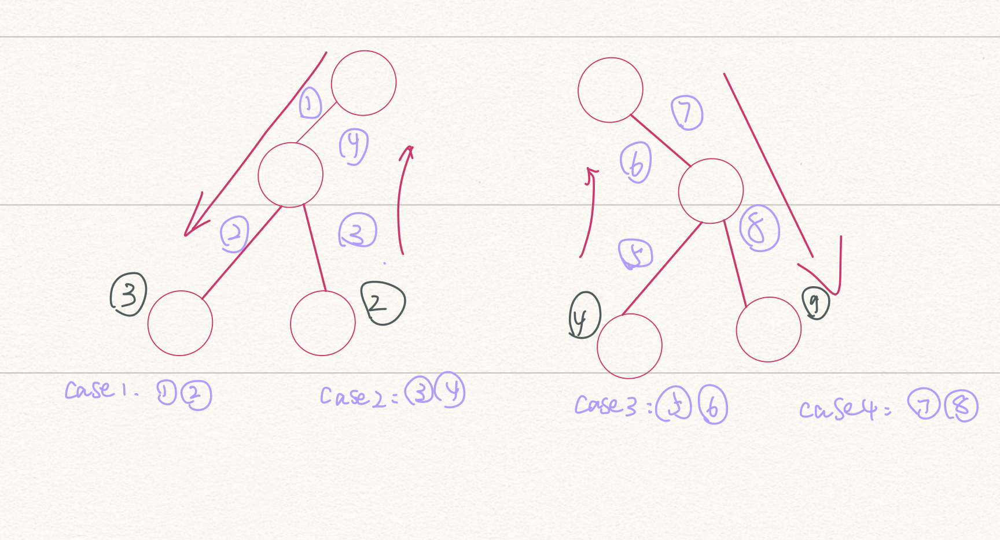


```python
insertSplay(tree, item):
  Input tree, item
  Output tree with item splay-insert
  
  if tree is empty:
    return node(item)
  elif item == data(tree):
    return tree
  
  elif item < data(tree):				// case1
    if left(tree) == empty:
      left(tree) = node(item);
    elif item < data(left(tree)):
      left(left(tree)) = insertSplay(left(left(tree)), item)
      tree = rotateRight(tree);
      	
    elif item > data(left(tree)):		// case 2
      right(left(tree)) = insertSplay(right(left(tree)), item);
      left(tree) = rotateLeft(left(tree));
    return rotateRight(tree)  
      
  else:                    // item > data(left(tree))
  	if right(tree) is empty:
      right(tree) = node(item);
    elif item < data(right(tree)):				// case3
      left(right(tree)) = insertSplay(left(right(tree)), item)
      right(tree) = rotateRight(right(tree))
    
    elif item > data(right(tree)):			// case 4
      right(right(tree)) = insertSplay(right(right(tree)), item)
      tree = rotateLeft(tree)
   	
    return rorateLeft(tree)
      
    
    
```

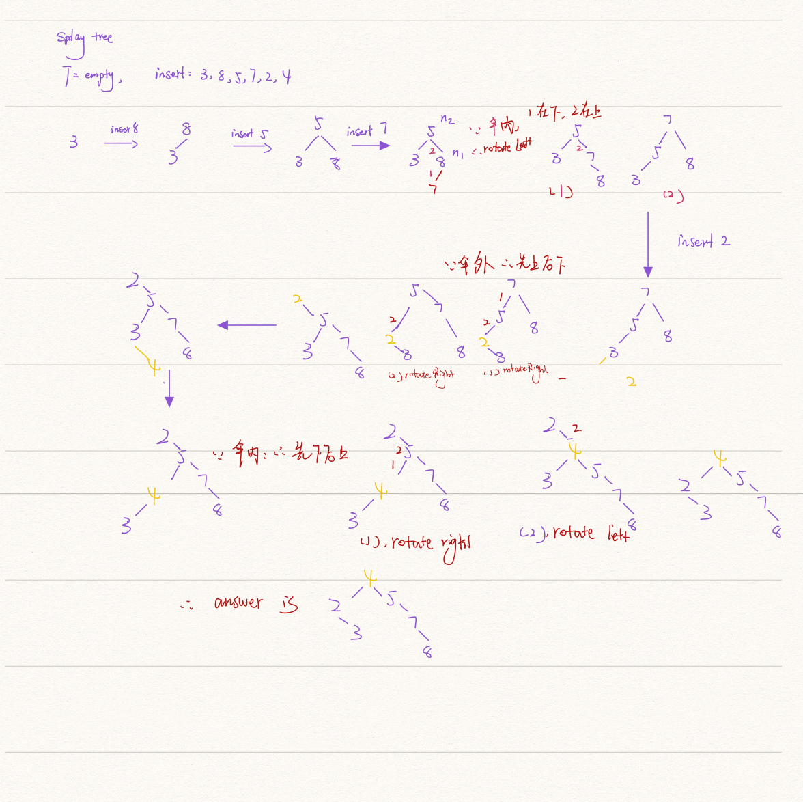


### 8.3 Real balanced tree

复杂度 `O(logn)`


#### AVL Tree

- rotation 思路: 不同于splay tree 伞状顺序, 伞外只需要rotation1次 , 哪个点 不平衡就rotation哪个

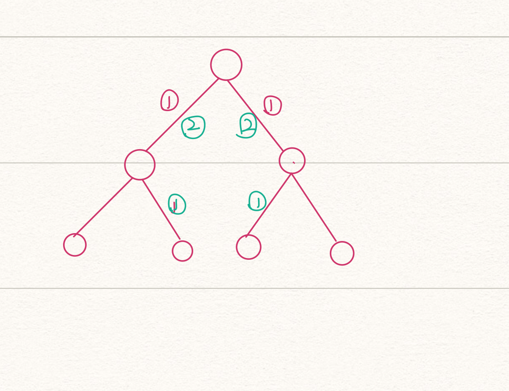

##### Psudeo

```python
insertAVL(tree, item):
	input tree, item
	Output tree with item AVL-inserted
	
	if tree is empty then:
		return node(item)
  elif item == data(tree):
  	return tree
  else
  	if item < data(tree) then
  		left(tree) = insertAVL(left(tree), item)
  	elif item > data(tree):
  		right(tree) = insertAVL(right(tree), item)
  	
  	if height(left(tree)) -  height(right(tree)) > 1:
  		if item > data(left(tree)):						#伞内多做一次,下到上
  			left(tree) = rotationLeft(left(tree))
  		tree = rotationRight(tree)		#伞外直接做一次rotation				
  	else if height(right(tree)) - height(left(tree)) > 1:
  		if item < data(right(tree)):
  			right(tree) = rotateRight(right(tree))
  		tree = rotateLeft(tree)
  		
```


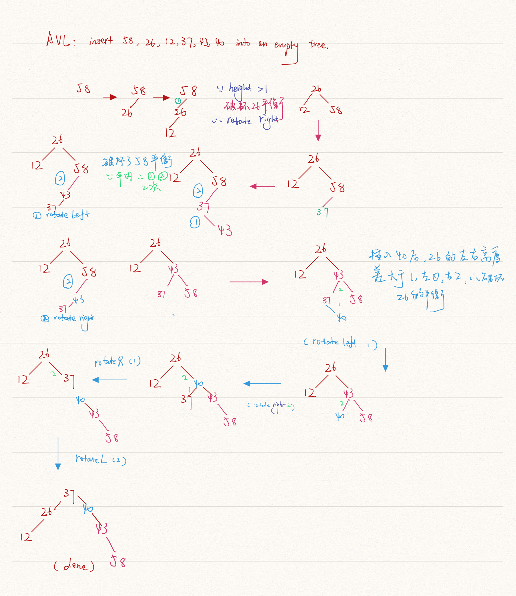


#### 2-3-4 Tree

- 2-nodes, 不是有两个node, 而是有2个children
- 3-nodes, 2 value 和3个children
- 4-nodes,  3 values 和 4 个 children


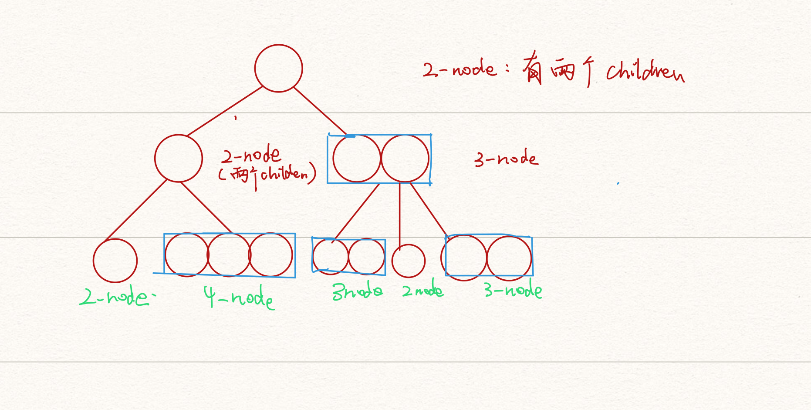


#####  Insertion into 2-3-4

```
// 结点满了向上走, 没满插入 
start with the root node
Repeat
 if current node is full (i.e. contatins 3 items)
 		- split into two 2-nodes
 		- promote middle element to parent
 				- if no parent: middle element becomes the new root 2-node
 		- go back to parent node
 		
 if current node is a leaf
 		- insert Item in this node, order++
 if current node is not a leaf
 		- go to child where Item belongs
 until item inserted
```

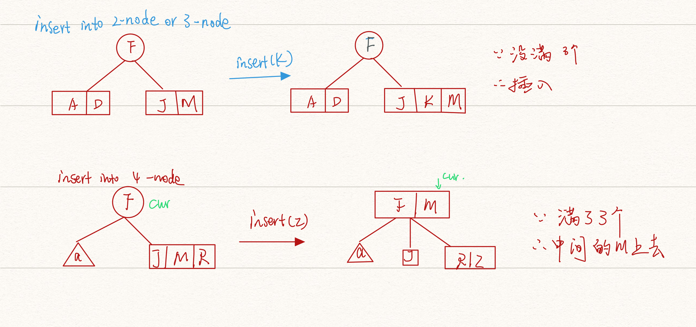


###### Insert key: 9,3,1,4,2,7,6,8,5 into empty tree

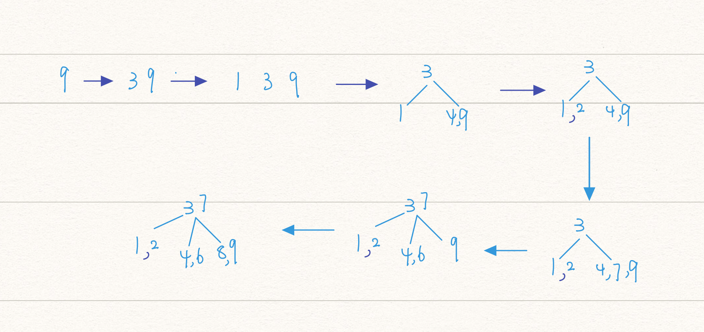


###### Show how a 2-3-4 tree would be constructed if the following values were inserted into an initially empty tree in the order given:

```
1 2 3 4 5 8 6 7 9 10
```


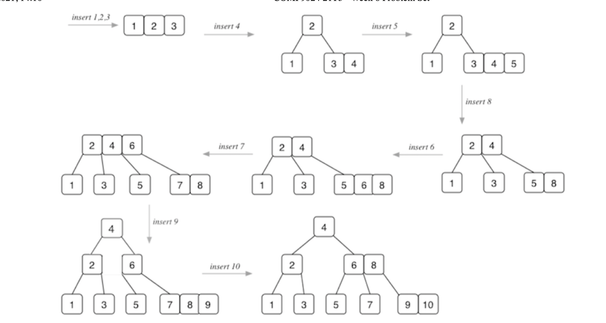

##### 红黑树

## 9 字符串匹配

### String 基础

- prefix
- suffixes
- substring

```
ex: a/a
how many prefixes?  	"" "a" "a/" 	"a/a"
how many suffixes?		"a/a"	 "/a"	"a"	"a"
find substring: 		"" "a" "/" "a/" "/a" "a/a"
```


### 9.0 Brute force

`O(nm)`

```python
def search(a, pattern):
    len_str = len(a)
    len_pattern = len(pattern)

    for i in range(0, len_str-len_pattern):
        j = 0
        while j < len_pattern and a[i+j] == pattern[j]:
            j += 1
            if j == len_pattern:
                return i
    return -1


if __name__ == '__main__':
    a = "Helloworld"
    pattern = "owo"
    index = search(a, pattern)
    print(index)
```

---

### 9.1 Boyer_Moore Algorithm

[算法文章链接](./ref/Boyer-Moore.pdf)

算法工具: https://cmps-people.ok.ubc.ca/ylucet/DS/BoyerMoore.html

```
best: O(m)
worst: O(nm+s)
```


> - Boyer_Moore 字符串匹配算法
> - 各种⽂本编辑器的"查找"功能 （Ctrl+F），⼤多采⽤Boyer-Moore算法。
> - 从后向前比较, 是在一个“主文本字符串”`S` 内查找一个“词”`W` 的出现，通过观察发现，在不匹配发生的时候这个词自身包含足够的信息来确定下一个匹配将在哪里开
> - 德克萨斯大学的Robert S. Boyer教授和J Strother Moore教授发明了这种算法。
>

---

#### 对比规则

##### 坏字符: bad suffix

> 坏字符:
> 如果string跟pattern 末尾不同, 那么就属于坏字符
>
> 查看string对应pattern的最后一位的字符x是在pattern是否存在, **从右往左对比!**
> 如果存在: indexofLast(x)pattern
> 如果不存在: indexofLast(x)pattern = -1
>
> 右移动 len(pattern) - indexofLast(x)pattern

```
比如: 
sufekl
01
ek

'u' != 'k', 属于坏字符
因为‘u’ 不在 “ek”中, 所以index = -1,  u对应的位置是k即1, 
右移1-(-1) = 2
-----------------------------
sufekl
  01
  ek
‘e’ 不在 “ek”中, 属于坏字符,
因为‘e’ 在 “ek”中, index e last occusion in ek is 0, string e对应 1
右移1-0 = 1
----------------
sufekl
   01
   ek
找到啦
```

#### 好字符: good suffix

>
> 如果string跟pattern 相同同, 那么就属于好字符
>
> 往前对比直到遇到不同的,此时, 好字符的最后一个如果存在pattern前面的位置, 那就让他们对齐
>
> 如果出现多次,也只对比好后缀的最后一个位置,和在pattern中最后第一次出现的位置(除了好字符本身)
>
> ```
> abacaabadcabacabaabb
>  012345
>  abacab
> 中pattern 'ba'是好字符, index 3: c 和 a不同
> 因为, a前面最后一次出现是在c左边的 index 2, 所以, 右移动 3 - 2 = 1
> abacaabadcabacabaabb
>   012345
>   abacab
>   
> ```


#### BMcase:

```python
HERE IS A SIMPLE EXAMPLE       #string
0123456
EXAMPLE                #pattern

#因为最后一位不对， 并且， string 所对应的pattern的最后一个值 S not in pattern ， 坏字符情况， 所对应的string直接移,： 6-（-1） = 7 位
HERE IS A SIMPLE EXAMPLE
       0123456
       EXAMPLE

#E 和 P 对不上， 属于坏字符情况， string 所对应的pattern的最后一个值 P  存在在pattern 里，lastOccasionIndex（p） = 4 即 P 在pattern中最后是在4位置，6 - 4 = 2, 右移2个

HERE IS A SIMPLE EXAMPLE
         0123456
         EXAMPLE

## 此时 string的最后一位 和 pattern 对上了 E， 属于好字符情况
## 继续检查 MPLE 属于好字符情况 good suffix
## 根据好字符规则， 后移位数 = 好后缀的位置 - 搜索词中的上⼀次出现位置， 
# 看E, 好后缀的位置： 6， 搜索词中上次出现位置：0, 后移： 6-0 = 6 
HERE IS A SIMPLE EXAMPLE
               0123456
               EXAMPLE
               
#因为PE不等， 所以是坏字符， P在pattern中存在， 即 4的位置； 后移： 6 - 4 = 2

HERE IS A SIMPLE EXAMPLE
                 0123456
                 EXAMPLE
#对比后发现，现在都是好字符啦，完全一样， 返回
```

 

#### BMcase2

total 13 comparison


#### calculate compression

```
GCCAGGATACAG
012
  1
GAG

GCCAGGATACAG
   012
    32
   GAG
   
 GCCAGGATACAG
     012
       4
     GAG
     
 GCCAGGATACAG
      012
        5
      GAG     

 GCCAGGATACAG
         012
           6
         GAG  


 GCCAGGATACAG
          012
          987
          GAG  
          
 GCCAGGATACAG
           012
           987
           GAG       
           
so total compression is 9           

```


---

### 9.2 KMP Algorithm

> `失效函数 O(m) 匹配: O(n)`
>
> `复杂度: O(m+n) `
>
> - Knuth-Morris-Pratt
> - 更快捷的字符串算法
> - 利用后缀是前缀的特性, 如果后缀匹配过, 前缀就不需要再匹配.

[KMP_Algorithm](./ref/KMP算法             .pdf) 


#### 计算步骤

##### step1. Failure function

> - 利用Failure function 来列出pattern的前后缀重合情况
> - the size of the largest `prefix of Pattern[0..j] = suffix of Pattern[1...j],` j is 1..m-1
>

ex: Pattern = "abacab"

| j    | Prefix (0..j) | Suffix (1..j) | Same |
| ---- | ------------- | ------------- | ---- |
| 1    | ab            | b             |      |
|      | a             | b             |      |
|      | ab            |               |      |
| 2    | aba           | ba            |      |
|      | **a**         | **a**         | ✔️    |
|      | ab            | ba            |      |
|      | aba           |               |      |
| 3    | abaa          | baa           |      |
|      | a             | a             | ✔️    |
|      | Ab            | aa            |      |
|      | Aba           | a ab          |      |
|      | Abaa          | Tab           |      |
| 4    | Abaab         | Baab          |      |
|      | a             | b             |      |
|      | Ab            | Ab            | ✔️    |
|      | Aba           | Baa           |      |
|      | Abaa          | Baab          |      |
|      | Ababa         |               |      |
| 5    | Abaaba        | Baaba         |      |
|      | a             | a             | ✔️    |
|      | Ab            | ba            |      |
|      | Aba           | Aba           | ✔    |
|      | Abaa          | Aaba          |      |
|      | Ababa         | Baaba         |      |
|      | Ababa         |               |      |

只有2345有相同的, 2中的唯一个len(prefix) = 1, 3 中 也是1,  4中len(prefix) = 2, 5 中有两个相同, 最长的prefix = 3

| j    | 0    | 1    | 2    | 3    | 4    | 5    |
| ---- | ---- | ---- | ---- | ---- | ---- | ---- |
| P    | a    | b    | a    | c    | a    | b    |
| F    | 0    | 0    | 1    | 0    | 1    | 2    |

---

##### step2. KMP Match

- input T of length n, pattern P of length m
- 从头开始比较, 找出相同的, 右往左
- 当j 匹配不上时候, 看前一个 i - 1, 找出(i-1) 对应的失效函数F的值, 让j跟F值对齐,
- 如果失效函数的对应值为0, 则从 0 开始比较
- 如果在0时没匹配上, 

```
abacaabaccabacabaabb
012345
abacab

//发01234相同, 5不同, 查计算出的 Failure Function 表可以发现, 4的位置有长度为1 的前缀, 5 跟 1对齐

abacaabaccabacabaabb
    012345
    abacab
    
// 前缀直接匹配上不用对比, 从1开始比较, 因为a 跟 b不同,所以不匹配, F(1-1) = 0, 所以1对应的string 跟 pattern[0]对齐

abacaabaccabacabaabb
     012345
     abacab
     
// 从0开始比较
// 开始对比,0123相同, 4 不同, F(4-1)的位置表中为0, 将4跟0对齐

abacaabaccabacabaabb
         012345
         abacab
// 从0开始比较
// string[0] != pattern[0],右移1格
abacaabaccabacabaabb
          012345
          abacab
// done
```


###### code

```python
# def KMPMatch(T, P):


def failureFunction(pattern):
    F = [0] * len(pattern)
    F[0] = 0  # F[0] is always 0
    j = 1  # start from substring 1,ex: abc start from ab
    L = 0
    while j < len(pattern):
        if pattern[j] == pattern[L]:
            L = L + 1
            F[j] = L  # P[0..L-1] = P[L-1..j]
            j = j + 1
        elif L > 0:  # mismatch and len >0
            L = F[L - 1]

        else:  # mismatch and len still 0
            F[j] = 0
            j += 1
    return F


def KMPMatch(T, P):
    F = failureFunction(P)
    i = 0
    j = 0
    while i < len(T):
        if T[i] == P[j]:
            if j == len(P) - 1:  # match found
                return i - j
            else:  # keep comparing
                i += 1
                j += 1
        elif j > 0:  # mismatch and j > 0
            j = F[j - 1]  # shift pattern to i - F[j-1]
        else:  # mismatch and j still 0
            i += 1  # begin to the next
    return -1


if __name__ == '__main__':
    Str = "abacaabaccabacabaabb"
    pattern = "abacab"
    print("Match at ", KMPMatch(Str, pattern))

```


---


### 9.3 Tries

- 又称字典树, 前缀树,单词查找树

- `O(logn)`

- 功能: 搜索自动补全

- root对应n个children,从根节点到某一节路径上的字符全部连接即为节点对应的字符串

- 任意节点的子节点包含字符都不相同

- 以树的类型生存, 以字典的形式存储

- 读到红色就代表到从root到这个点构成一个有效单词, 如下

  

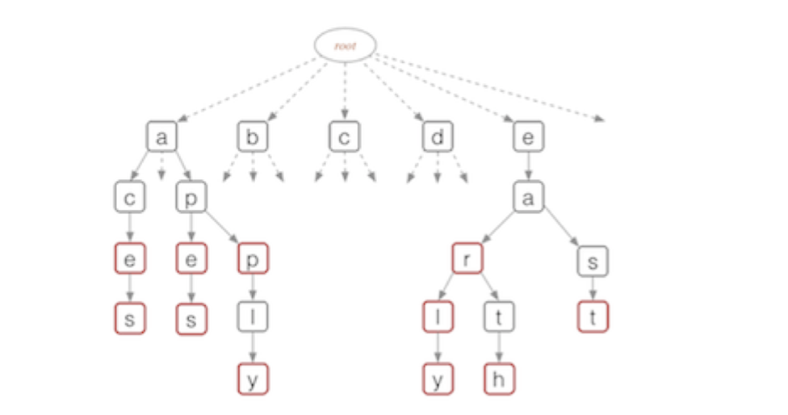

`这里构成word的情况有: ace,aces,ape,apes,app,apply,ear,earl,early`

#### 

#### compressed Tries

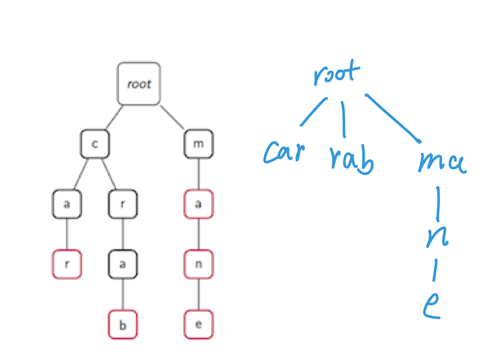


#### Trie Insertion 

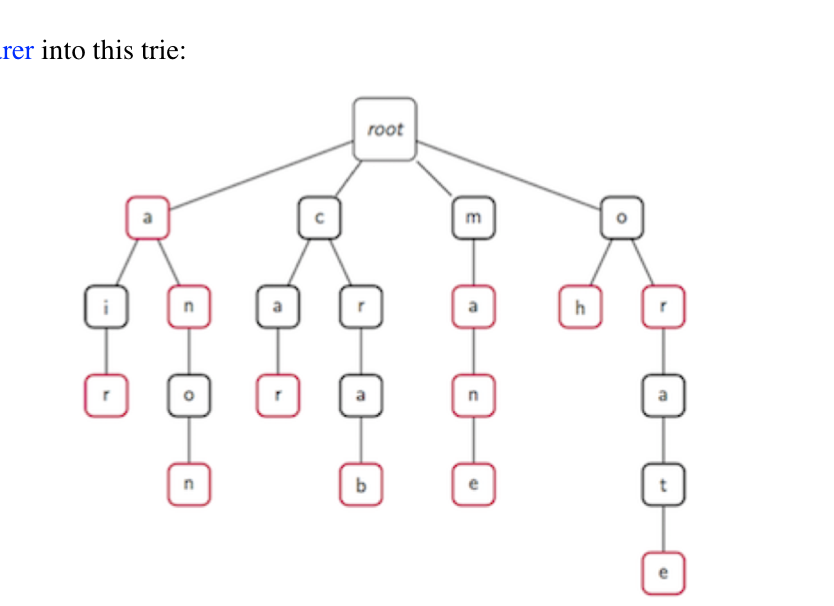


---

### 9.4 Huffman Code

- 用途: 文本压缩

- Priority queue

- `O(n+dlogd)     `,  n...length of the input text T. d...number of distinct characters in T 

- 计算单词词频, 从大到小排序, 出现最高的给一个最小编码

  ```
  T = abracadabra, 11byte, 88 bit  
  a:5 b :2 c:1 r: 2 d:1      
  after sort:
  d = 1, c= 1, b = 2, r = 2, a = 5 -------->. 从小到大
  ```

  

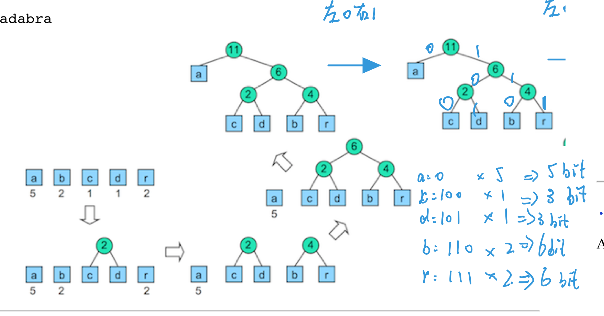

```
5+3+3+6+6 = 23 bits
(23/88)%
```


