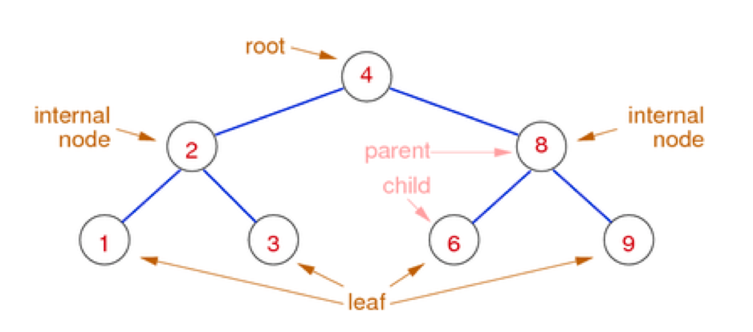
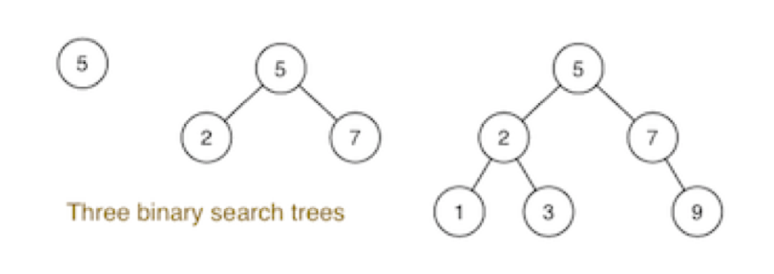
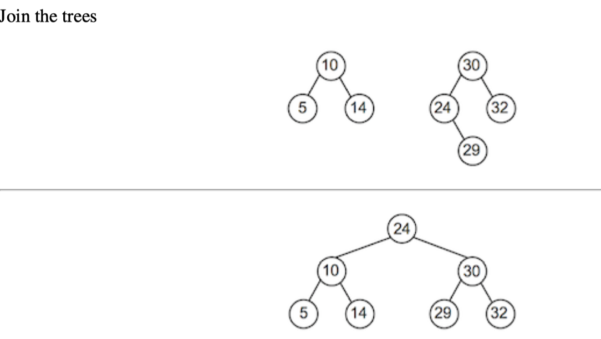
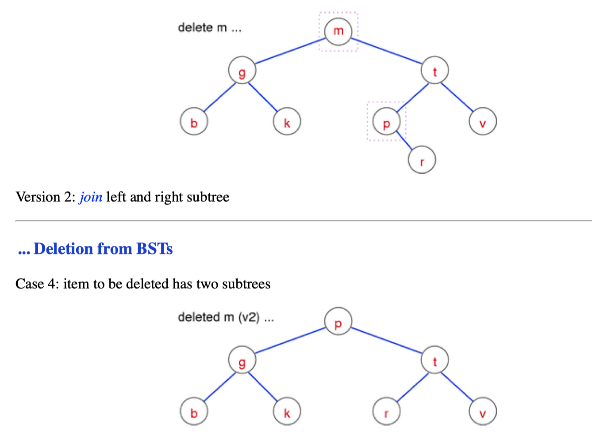
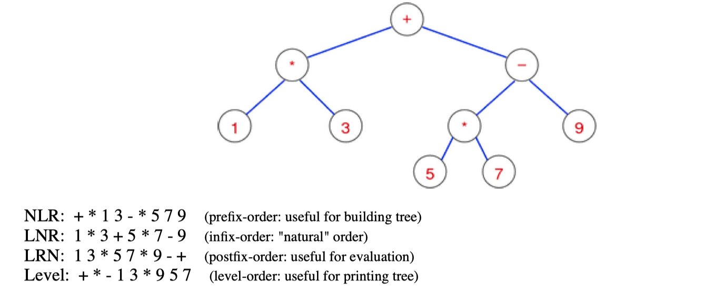
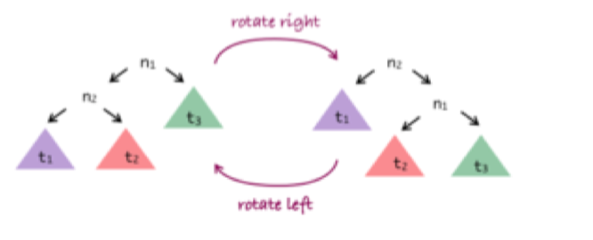
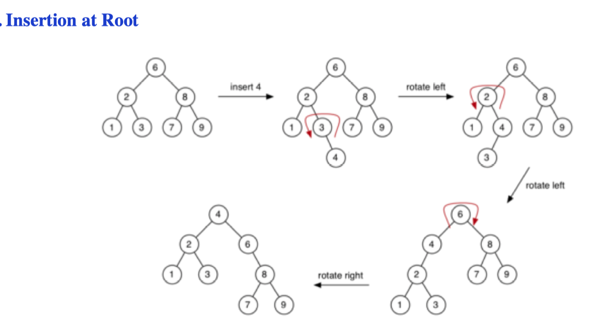
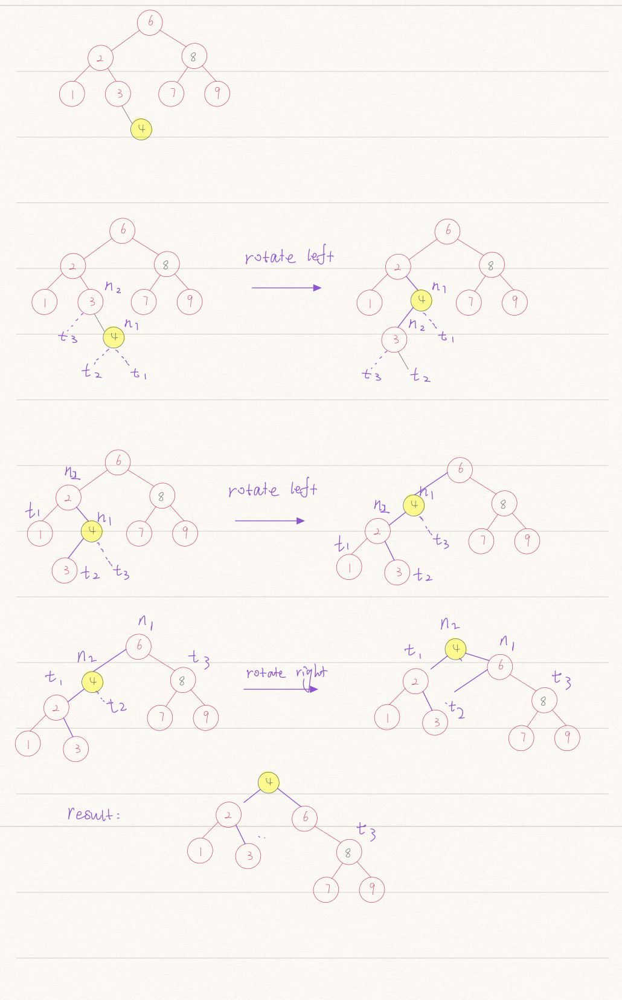

# Data structure & algorithm


---

## 7. Search Tree Data Structures

### 7.1 Tree Data Structures

- Consisting of `nodes` and `edges` (called links), **with no cycles** (no "up-links")
- each node contains a `data `value (or key+data)
- each node has links to ≤ k other child nodes



---

### 7.2 Binary Search Trees

#### Define of BT

```
- each node is the root of 0, 1 or 2 subtrees
- empty (contains no nodes)
- consists of a node, with two subtrees
```


#### BST Properties

```
- each node is the root of 0, 1, 2 subtrees
- value(left subtree ) < root
- value(right subtree) > root
```





#### BST 关键词

- Height

  ```
  - Height (or: depth) of tree = max path length from root to leaf
  - Time complexity of tree algorithms is typically O(height)
  ```

- level

  ```
  Path length from root to node
  ```


#### Pseudo Searching in BSTs

#### Tree struct 

```c
// Struct of BST
// a Tree is represented by a pointer to its root node
typedef struct Node *Tree;
// a Node contains its data, plus left and right subtrees
typedef struct Node {
  Item data;								//Item is itnt
  Tree left, right
} Node;

// some macros that we will use frequently
#define data(tree) ((tree)->data)
#define left(tree) ((tree)->left)
#define right(tree) ((tree)->right)
```

---

##### TreeSearch

```c
TreeSearch(tree,item):
	Input tree, item
	Output true if item found in tree, false otherwise
  if tree is empty then
    return false
  else if item < data(tree) then
    return TreeSearch(left(tree),item)
  else if item > data(tree) then
    return TreeSearch(right(tree),item)
  else // found 
    return true 
  end if
```

##### insertAtLeaf

```c
insertAtLeaf(tree,item):
Input tree, item 
Output tree with item inserted
if tree is empty then 
	return new node containing item
else if item < data(tree) then 
  return insertAtLeaf(left(tree),item)
else if item > data(tree) then
  return insertAtLeaf(right(tree),item)
else
  return tree // avoid duplicates 
end if
```

---

##### Join two tree



```c
// 找到t2的最左边的最小值
//因为bst大小是有序的,左子树一定比右子树小
//设置它作为root, 重新链接它与右树的顶点, 再链接左子树
joinTrees(t 1 ,t 2 ):
	Input trees t 1 ,t 2
  Output t 1 and t 2 joined together
  
  if t1 is empty
    return t2
	else if t2 is empty
    return t1
  else
    curr=t2 , parent=NULL
    while left(cur) is not empty
      parent = curr
      curr = left(curr)
   	if parent != NULL
      left(parent) = right(curr)
      right(curr) = t2
    left(curr) = t1
    retur curr 
```

---

#### Delete the trees



```c
// 找到待删除位置
// 待删除 root 如果只有1个子节点,删除并让子节点候补上去
// 待删除root 如果有两个, 则通过前面定义的join重构树

TreeDelete(t, item):
	Input tree t, item
  Output t with item deleted
  if t is not empty:
    if item < data(t):
			left(t) = TreeDelete(left(t), item)
    else if item > data(t):
			right(t) = TreeDelete(right(t), item)
    else
      if left(t) and right(t) are empty
        new = empty tree
      else if left(t) is empty
        new = left(t)
      else
        new = joinTrees(left(t), right(t))
      free(t)
      t = new
  return t
```

---

#### Tree Traversal	

##### - preorder(NLR)

```visit root, then left subtree, then right subtree```

##### - inorder(LNR)

```visit left subtree, then root, then right subtree```

##### - postorder(LRN)

```visit left subtree, then right subtree, then root```

##### - level-order

```
visit root, then all its children, then all their children
```


##### Tree Traversal case 




---

### 7.3 Balanced Binary Search Trees

#### Define

```
- Goal: build binary search trees which have
	minimum height ⇒ minimum worst case search cost
	
- abs(#nodes(LeftSubtree) - #nodes(RightSubtree)) ≤ 1
- height of log 2 N ⇒ worst case search O(log N)
```


#### Perfect balanced tree Properties

```
- #nodes in left subtree = #nodes in right subtree
```


### 7.4 Rebalancing

**Tree Rotation**

``` tree rotation: O(1)```



#### Pseudo

#####  RotateRight

```python
# input: tree n1
#  output: n1 rotate to the right
rotateRight(n1):
  if n1 is empty or left(n1) is empty:
    return n1
	n2 = left(n1)
  left(n1) = right(n2)
  right(n2) = n1
  return n2
```

---

##### RotateLeft

```python
# input: tree n2
# output: n2 rotate to the right
rotateLeft(n2):
  if n2 is empty or right(n2) is empty:
    return n2
  n1 = right(n2)
  t2 = left(n1)
  left(n1) = n2
  right(n2) = t2;
  return n2
  
```

---


#### Insertion at Root

- 通过上面的rotation规则我们对节点所在位置进行规划, 通过左旋或者右旋,直到插入点变成顶点
- same complexity as for insertion-at-leaf: **O(height)**

```
base case:
tree is empty; make new node and make it root

recursive case:
- insert new node as root of appropriate subtree
- lift new node to root by rotation
```



base case:

tree is empty; make new node and make it root recursive case:

insert new node as root of appropriate subtree lift new node to root by rotation


